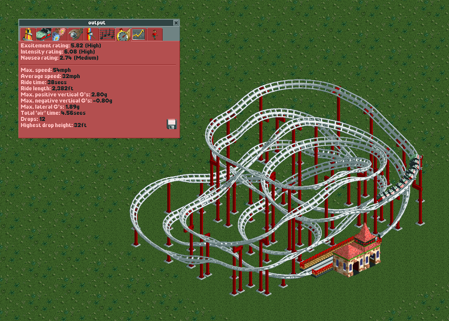

# coaster_generator
Code to randomly generate coasters in OpenRCT2

## Building

This code relies on [OpenRCT2](https://github.com/OpenRCT2/OpenRCT2). To build,
replace `src/openrct2-cli/Cli.cpp` with the file in this repository. To make
it run much faster, after cmake, use:

```
	make CMAKE_CXX_FLAGS="-O2"
```

Then run:

```
	./openrct2-cli
```

## Code walkthrough

Everything is configured in code for now, sorry. There are some general settings
in the beginning:

	* `kTrackToLoad` is a sample track to load and then modify. This is provided
	  as template.td6
	* `kTrackToSave` is the output.
	* The following three numbers are the dimensions of the coaster to generate
	* `kMinimumTrackSize` is the minimum number of track pieces in the desired
	  coaster.
	* `kTryPerAttempt` is the number of times we try backtracking before giving
	  up. Setting it higher will result in a deeper search that takes longer.

You might notice that the coordinates used everywhere are ordered weird: 
`(y, x, z)`. This is due to laziness on my part. When I started mapping
everything using pen and paper the `(y, x)` order made sense, so it stuck. As
everything in the base data is oriented north, `y + 1` is up, `y - 1` is down,
`x + 1` is right and `x - 1` is left. This is only important if you want to add
support for more track pieces.

There are many global data structures that the coaster generator uses:

	* `dirStateMachine` maps track elements to the functions that take care 
	  of updating our direction.
	* Then a number of vectors called `statesForTrackElem*` follow. These list
	  the possible track pieces following the piece the vector was named after.
	  For example, `statesForTrackElemFlat` contains
	  `TRACK_ELEM_FLAT_TO_25_DEG_DOWN`, because this is a valid transition.
	* Then `trackStateMachine` maps track pieces to the vectors described above.
	  This is to avoid repetition, because quite a few of these are reused. For
	  example you can have the same kinds of pieces after a non-banked left turn
	  and right turn. Note: to generate coasters with better stats, I only allow
	  banked turns in this state machine.
	* The structs called `trackPieceFor*` describe a `TrackPiece` struct for
	  different kinds of track pieces. This contains a `shape`, which is a list
	  of coordinates `(y, x, z)` and a `cell` (see explanation below), as well
	  as a `ptr`, which tells us where the next track piece goes.For example
	  after a flat piece the ptr is (1, 0, 0) because y is increased by 1.

A `cell` describes the 2 quarters of a tile that can be occupied, as not every
track piece occupies a full tile. In the `Cell` structure there are 4 integers
`c00`, `c01`, `c10`, `c11`, which are laid out like this (again, with north
being the original orientation):

```
	c10  c11
	c00  c01
```

`trackData` maps track pieces to their data described above, to avoid
repetition. You can notice that only right turns are included. This is because
all this data is mirrored in the beginning of `Generate`. This function also
generates data for all orientations other than north.

You can find the start and end coordinates for the coaster starting on line 925.
`endCoord` is where the generator must land to finish a coaster (with direction
east)., the start position being specified in the original entry on the `stack`
used for backtracking (line 933).

After this bit you will see an initial coaster being added to the track list
(and to the 3d space used by the generator). This is a station followed by two
leftward turns. This would generate a coaster that has to be launched. To add
lift hills you can add `{TRACK_ELEM_FLAT_TO_25_DEG_UP, 132}` and then many
pieces of `{TRACK_ELEM_25_DEG_UP, 132}`. These numbers are the flags used by
track pieces to specify lift hills.

Finally, this code currently uses a very primitive way to try and generate
coasters that can actually make a full circuit. The maximum allowed height is
decreased as there are more and more pieces. You can see this on line 748. This
obviously fails in a lot of cases, but when generating small coasters it might
work. When generating large coasters, a lot of manual inspection is necessary,
and unfortunately you most probably will need to add boosters.

## Example


